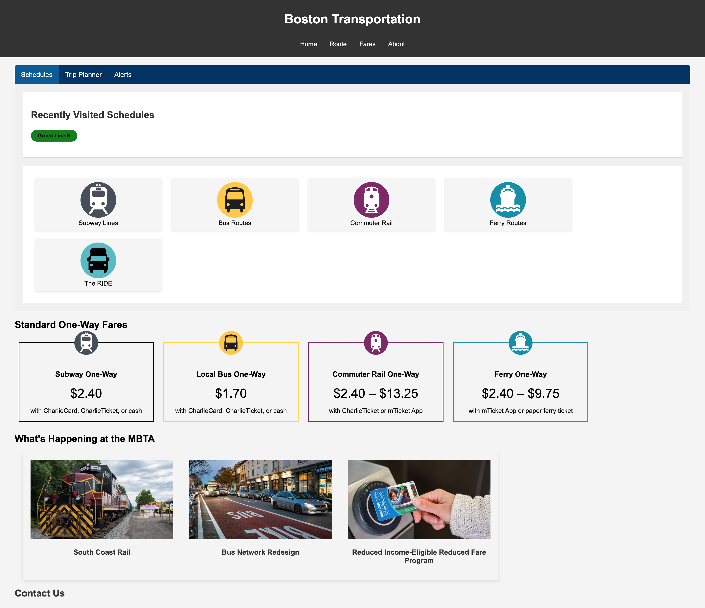
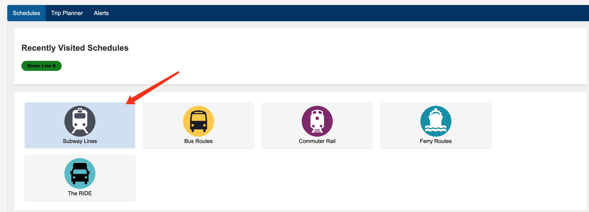
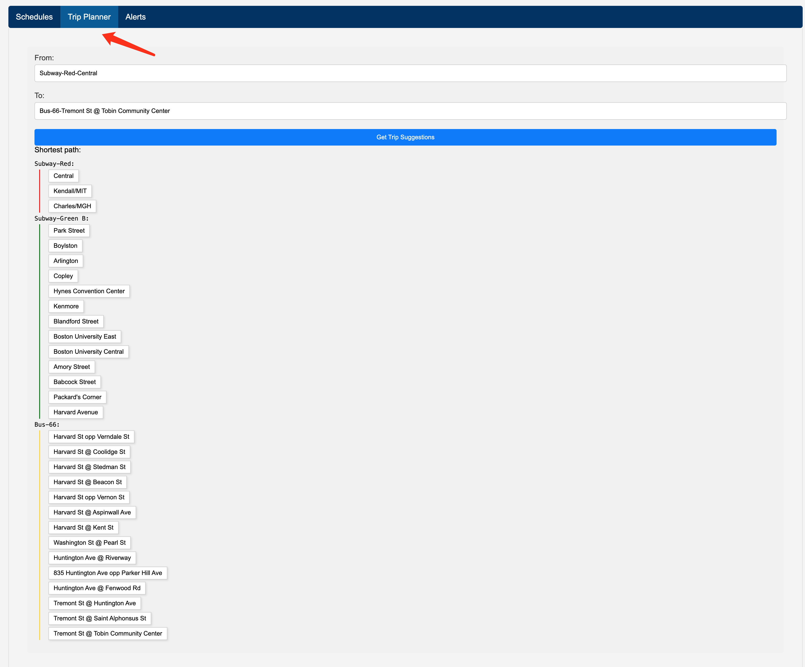
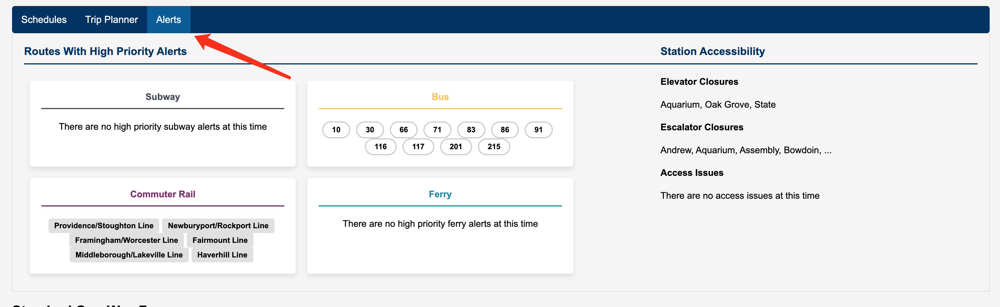
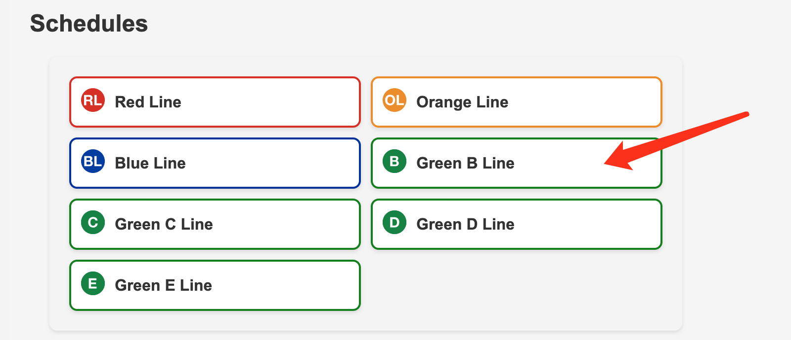
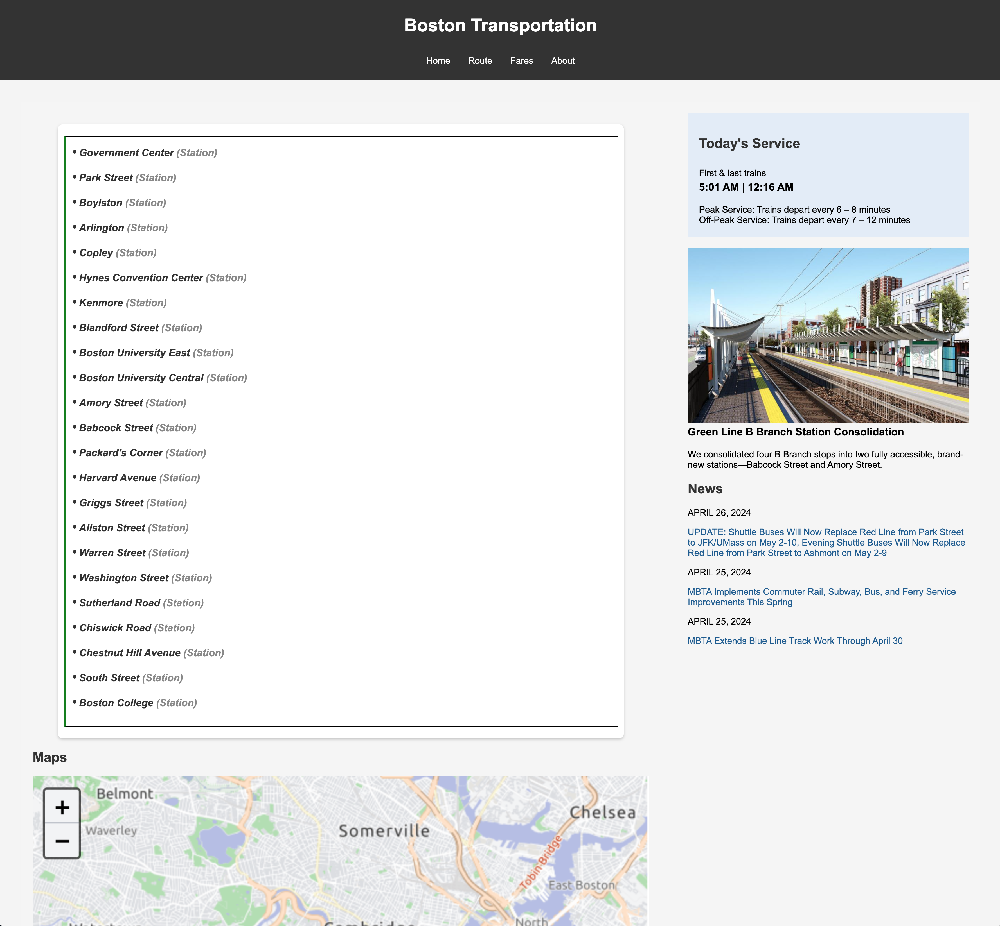
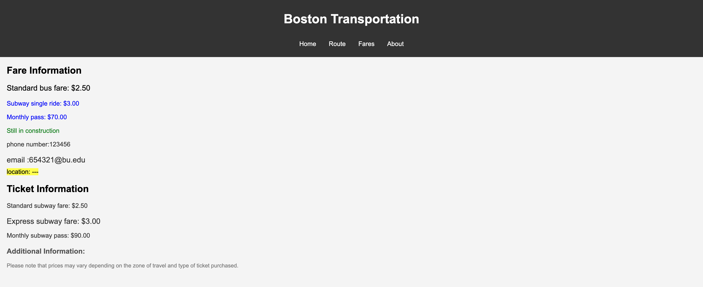
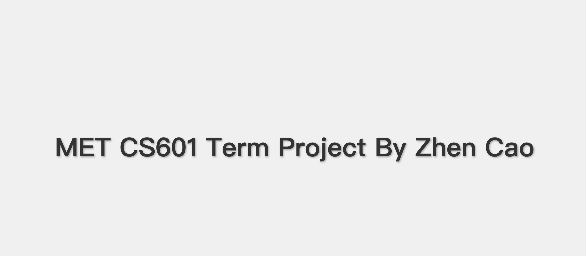

# CS601-TermProject

# Boston Transportation

## 1. Home Page

The homepage content mainly includes the navigation bar at the top, and three main function tabs. The three tabs are Schedules, which can view subway lines, Trip Planner, which can plan routes by entering the starting station and target station, and Alerts, which can be used in real time through the MBTA API to get the fault status of the current line.

There is also content about Fares and News below. The icon is a vector image from the MBTA official website.

### 1.1 Schedules

The Schedules here can quickly navigate to the designated transportation web page.

### 1.2 Trip Planner

Here is the shortest path calculated using Dijkstra's algorithm. Of course, only three routes are included for simplicity.

### 1.3 Alerts

The Alerts here are obtained based on the severity level. Only those with a level above 6 will be displayed in the alerts. These are basically due to delay.

MBTA API: https://api-v3.mbta.com/docs/swagger/index.html

You need to apply for a token to use this API.

## 2. Subway Page

Click Subway Lines ->

This webpage is the homepage of Subway. You can filter subway lines by searching. The content of the webpage is divided into two columns for the sake of beauty.

## 3. Green B Line Page

Click Green B Line ->

The design of this page is similar to the Subway homepage, but the map below can be clicked to become a full-screen Google map for interaction. This page is mainly designed to try various CSS styles

## 4. Fare Page

## 5. About Page

